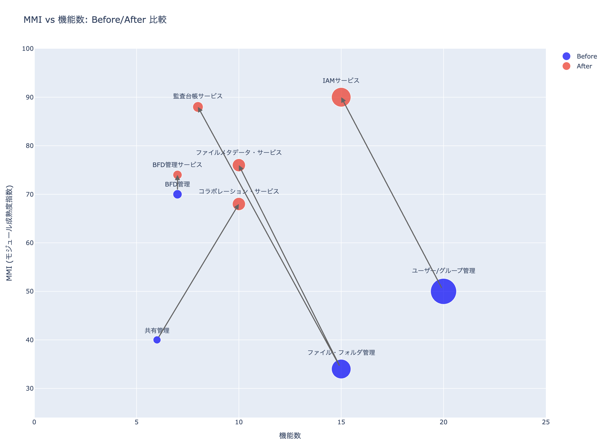

# リファクタリングの実行サンプル

`domain-refactering-agent.md`を使った実行サンプルです。

このサンプルでは、ScalarDB/ScalarDLを用いた改ざん検知機能を持ったファイルシステムをモジュラーモノリスで作ったものを対象に解析した結果をサンプルとしています。
なお、読み込ませたソフトウェアは、ドキュメントとコードの両方を解析しています。

## 実行手順
Gemini CLI を用いて、以下のように実行します。
1. Gemini CLIを起動
2. `domain-refactering-agent.md`を Gemini に読ませる
3. 分析対象のディレクトリを指定し、レポートを出力するように指示する

## 実行結果

* [ドメイン分析](./reports/01_domain_analysis.md)
* [システムマッピング](./reports/02_system_mapping.md)
* [ターゲットアーキテクチャ](./reports/03_target_architecture.md)
* [移行計画](./reports/04_transformation_plan.md)
* [オペレーションとフィードバック](./reports/05_operations_and_feedback.md)
* [モジュール成熟度指数](./reports/06_mmi_overview.md)
* [モジュールとドメインごとのモジュール成熟度指数](./reports/07_mmi_by_module_and_domain.md)
* [モジュール成熟度改善計画](./reports/08_mmi_improvement_plan.md)

