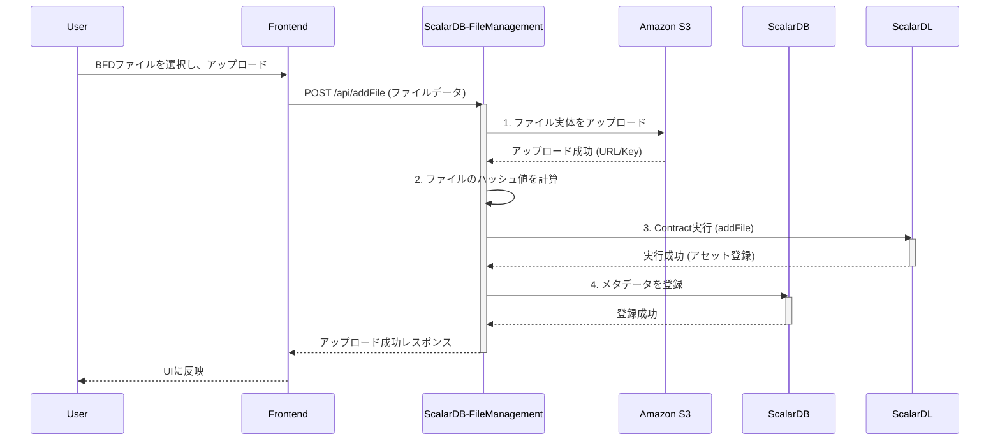

# 現行システムとドメインのマッピング (02_system_mapping.md)

本ドキュメントは、`file-manager-main` プロジェクトの現行アーキテクチャを構成するコンポーネントと、`01_domain_analysis.md` で定義した現行ドメインとのマッピングを明確にし、データとトランザクションの依存関係を可視化します。

---

## 1. アプリケーション/モジュールとドメインのマッピング

設計書に基づき、物理的なコンポーネントと論理的なドメインの対応関係を以下に示します。

| コンポーネント | 担当する現行ドメイン | 説明 |
| :--- | :--- | :--- |
| **Frontend** | (全ドメインのUI) | ユーザーが操作を行うWebインターフェース。BackendのAPIを呼び出し、UIを構築する。ドメインロジックは保持しない。 |
| **ScalarDB-FileManagement (Backend)** | ・ユーザー管理 ・グループ管理 ・ファイル・フォルダ管理 ・共有管理 | システムの中核をなすモノリシックなSpring Bootアプリケーション。BFD管理を除く、ほぼ全てのビジネスロジックとドメインルールを実装している。 |
| **ScalarDB-FileManagement_BFD (BFD Microservice)** | ・BFD管理 | 設計書で「microservice」として言及されているコンポーネント。データベースに直接アクセスし、障害の注入と回復を行う特殊な管理ツール。 |

---

## 2. データストレージとエンティティ（推定）

ソースコードの分析は未実施のため、設計書からデータモデルを以下のように推定します。

| ストレージ | エンティティ / テーブル（推定） | 説明 | 関連ドメイン |
| :--- | :--- | :--- | :--- |
| **ScalarDB (Mutable)** | `users` | ユーザー情報（ID, name, email, role, password_hash） | ユーザー管理 |
| | `groups` | グループ情報（ID, name, owner_id） | グループ管理 |
| | `group_members` | グループとユーザーの中間テーブル | グループ管理 |
| | `files` / `folders` | ファイルとフォルダのメタデータ（ID, name, path, owner_id, is_bfd, latest_version_id, s3_url, hash） | ファイル・フォルダ管理 |
| | `access_control_list` | ファイル/フォルダとユーザー/グループの共有設定と権限（item_id, principal_id, principal_type, privilege） | 共有管理 |
| **ScalarDL (Immutable)** | `file_operations` (Asset) | BFDファイルに対する操作履歴を記録する台帳（アセット）。トランザクションごとに操作内容（`add`, `update`）、ファイルID、バージョン、ハッシュ値などが記録される。 | ファイル・フォルダ管理, BFD管理 |
| **Amazon S3 (Blob Storage)** | (File objects) | アップロードされたファイルの実体（バイナリデータ）。 | ファイル・フォルダ管理 |

---

## 3. トランザクション依存関係（BFDファイルアップロード時）

ユーザーがBFD（Byzantine Fault Detectable）ファイルをアップロードする際の、コンポーネントとデータストア間の依存関係をMermaidシーケンス図で示します。
これは、複数のデータストアを更新する上で最も代表的で複雑なトランザクションの一つです。

**解説:**
このシーケンスは、Backend内で複数のリソース（S3, ScalarDL, ScalarDB）にまたがる更新処理が発生することを示しています。
現状のモノリシックなBackendアプリケーションは、これら一連の処理を一つのトランザクションとしてまとめ、整合性を保証する責任を負っています。特に、ScalarDL（Ledger）とScalarDBへの書き込みは、分散トランザクション管理が必要となる重要なポイントです。

---

## 4. ScalarDB/DL 利用状況サマリ

このシステムはScalar製品の機能を積極的に活用しています。ドメインごとの利用状況は以下の通りです。

| 現行ドメイン | ScalarDB 利用 | ScalarDL 利用 | 主な目的 |
| :--- | :---: | :---: | :--- |
| **ユーザー管理** | ✔ | | ユーザー、ロール情報の永続化 |
| **グループ管理** | ✔ | | グループ、メンバー情報の永続化 |
| **ファイル・フォルダ管理** | ✔ | ✔ | ファイルメタデータの管理と、BFDファイル操作履歴の改竄不可能な記録 |
| **共有管理** | ✔ | | アクセス制御リスト（ACL）の永続化 |
| **BFD管理** | ✔ | ✔ | ScalarDBおよびScalarDLのデータを直接操作し、障害注入と回復を行う |

このマッピングから、特に「ファイル・フォルダ管理」と「BFD管理」ドメインが、システムの核となる耐改竄性機能を実現するためにScalarDBとScalarDLに深く依存していることがわかります。アーキテクチャの変革においては、このデータアクセスパターンをどのように維持・改善するかが鍵となります。
