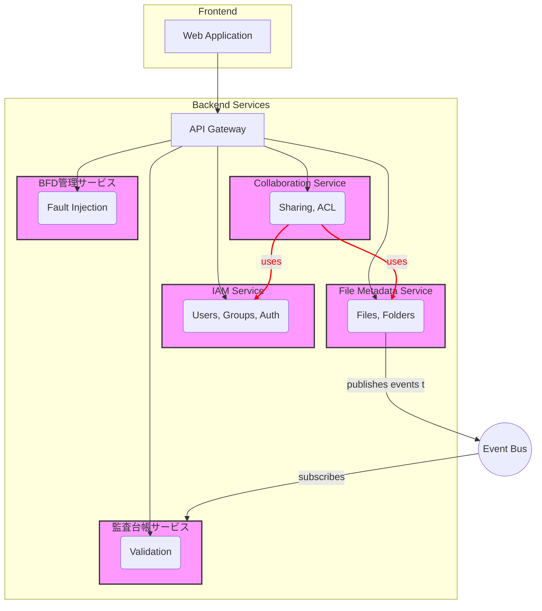
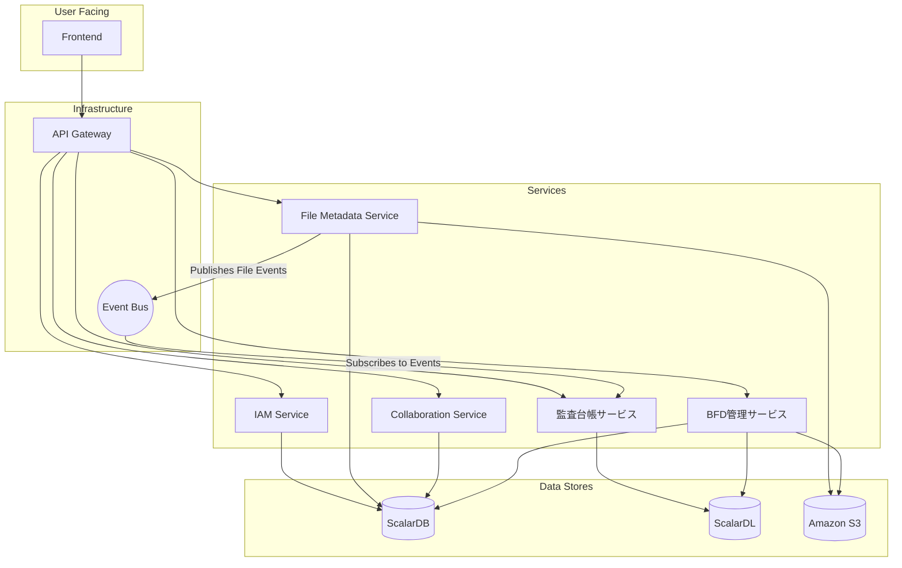

# ターゲットアーキテクチャ設計 (03_target_architecture.md)

本ドキュメントでは、`01_domain_analysis.md` で再定義したドメインに基づき、`file-manager-main` プロジェクトが目指すべきマイクロサービスアーキテクチャ（ターゲットアーキテクチャ）を提案します。

---

## 1. Context Map

再定義したドメイン（サービス）間の関係性を DDD の Context Map パターンを用いて表現します。各サービスは明確な境界を持つコンテキストとして扱います。

**関係性の解説:**
- **API Gateway:** `Frontend` からのすべてのリクエストを受け付ける単一のエンドポイント。認証、ルーティング、レート制限などを担当します。
- **IAM Service (U, OHS):** 認証・認可を担う上流(Upstream)サービス。Open Host Service (OHS)として、標準的なプロトコル（例: OAuth2.0, OpenID Connect）を提供します。
- **File Metadata Service (U, OHS):** ファイルとフォルダのメタデータを管理する中心的な上流サービス。
- **Collaboration Service (D):** `IAM` と `File Metadata` を利用する下流(Downstream)サービス。
- **監査台帳サービス (D, ACL):** `File Metadata` サービスが発行するイベントを購読する下流サービス。Anti-Corruption Layer (ACL) を持ち、上流のイベント形式の変更から自身のドメインを保護します。
- **イベント駆動連携:** `File Metadata` サービスと `監査台帳` サービスは、イベントバス（例: Kafka, AWS SNS/SQS）を介して非同期に連携します。これにより、ファイル操作と監査記録の処理が分離され、システムの回復力と拡張性が向上します。

---

## 2. Macro Architecture

各マイクロサービスとデータストア、および横断的関心事を考慮したマクロアーキテクチャ図を示します。

**主要コンポーネントとデータストア:**
- **IAM Service:**
  - **Data Store:** `ScalarDB` (IAM Namespace) - `users`, `groups`, `roles` テーブルを管理。
- **File Metadata Service:**
  - **Data Store:** `ScalarDB` (File Namespace) - `files`, `folders` テーブルを管理。`S3` にファイル実体を保存。
- **Collaboration Service:**
  - **Data Store:** `ScalarDB` (Collaboration Namespace) - `acl`, `shares` テーブルを管理。
- **監査台帳サービス:**
  - **Data Store:** `ScalarDL` (Ledger) - `file_operations` アセットを管理。
- **BFD管理サービス:**
  - **Data Store:** `ScalarDB`, `ScalarDL`, `S3` に直接アクセス。

**データ管理戦略:**
- **Database per Service パターン:** 各サービスが自身のデータを所有し、他のサービスはAPI経由でのみアクセス可能とする。
- **論理的なデータ分離:** 物理的には同じ `ScalarDB` / `ScalarDL` インスタンスを共有しつつ、サービスごとに**Namespace**を分けることで論理的な分離を実現する。これにより、運用コストを抑えつつ、サービス間の疎結合を促進する。

---

## 3. Cross-cutting Concerns (横断的関心事)

マイクロサービスアーキテクチャでは、複数のサービスに共通する課題（横断的関心事）を一元的に解決する仕組みが必要です。

| 関心事 | 解決策 |
| :--- | :--- |
| **API Gateway** | `Frontend` とバックエンドサービスの間に配置。リクエストのルーティング、認証（JWT検証）、レート制限、リクエスト/レスポンスの変換などを担当。 |
| **Service Discovery** | コンテナオーケストレーションツール（例: Kubernetes）が提供するDNSベースのサービスディスカバリを利用。 |
| **Authentication & Authorization** | `IAMサービス` が認証を行い、JWTを発行。`API Gateway` と各マイクロサービスは、リクエストヘッダのJWTを検証して認可を行う。 |
| **Observability (監視性)** | - **Logging:** 全サービスのログを集中管理基盤（例: ELK Stack, Loki）に集約。 - **Metrics:** Prometheus を用いて各サービスのパフォーマンスメトリクスを収集し、Grafana で可視化。 - **Tracing:** OpenTelemetry を導入し、サービスをまたがるリクエストの分散トレーシングを実現。 |
| **Configuration** | 設定情報を各サービスから分離し、Config Server（例: Spring Cloud Config）や Kubernetes ConfigMap/Secrets で一元管理する。 |

---

## 4. 連携パターン

サービス間の特性に応じて、同期・非同期の連携パターンを使い分けます。

- **同期連携 (Synchronous Communication):**
  - **目的:** リクエストに対して即時の応答が必要な場合。
  - **技術:** REST (JSON over HTTP) または gRPC。
  - **例:**
    - `Frontend` が `API Gateway` 経由でファイルリストを要求する場合。
    - `Collaboration Service` が `IAM Service` にユーザー情報を問い合わせる場合。
  - **課題:** サービス間の結合度が高まり、一方が障害を起こすと呼び出し元も影響を受ける可能性がある（連鎖障害）。サーキットブレーカーパターンの導入が推奨される。

- **非同期連携 (Asynchronous Communication):**
  - **目的:** サービス間の結合度を下げ、耐障害性とスケーラビリティを向上させる場合。
  - **技術:** イベントバス（メッセージキュー）。例: Apache Kafka, RabbitMQ, AWS SNS/SQS。
  - **例:**
    - `File Metadata Service` がファイル作成時に `FileCreated` イベントを発行する。
    - `監査台帳サービス` はそのイベントを購読し、非同期で ScalarDL に操作履歴を記録する。
  - **利点:** 結果整合性（Eventual Consistency）を許容することで、システム全体のパフォーマンスと回復力を高めることができる。

このターゲットアーキテクチャを採用することで、各ドメインの独立性を高め、チームごとの自律的な開発、デプロイ、スケーリングが可能となり、ビジネスの変化に迅速に対応できる技術的基盤を構築します。
